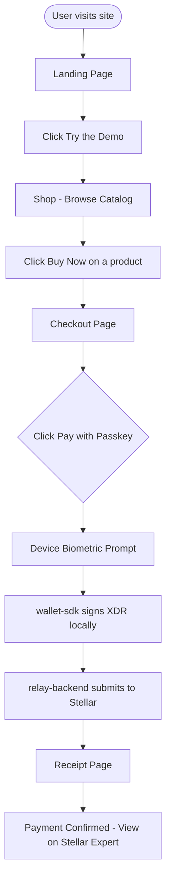
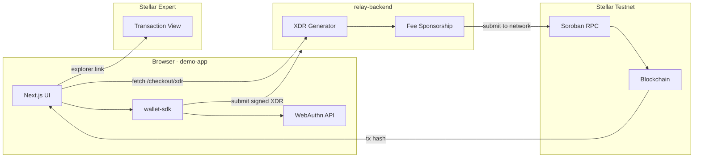

<p align="center">
  
</p>

<h1 align="center">🛒 Rayos Demo App</h1>

<p align="center">
  <strong>A gasless, passkey-signed checkout experience built on Stellar Soroban Testnet.</strong><br/>
  Pay for anything in one biometric tap — no seed phrases, no browser extensions, no gas fees.
</p>

<p align="center">
  
  
  
  
  
  
  
  
</p>

<p align="center">
  <a href="https://rayos-demo-app.vercel.app/">🌐 Live Demo</a>
  &nbsp;·&nbsp;
  <a href="docs/ARCHITECTURE.md">📐 Architecture</a>
  &nbsp;·&nbsp;
  <a href="docs/SETUP.md">🛠 Setup Guide</a>
  &nbsp;·&nbsp;
  <a href="docs/TESTING.md">🧪 Testing Guide</a>
  &nbsp;·&nbsp;
  <a href="docs/CONTRIBUTING.md">🤝 Contributing</a>
  &nbsp;·&nbsp;
  <a href="https://github.com/Rayos-Org/demo-app/issues">🐛 Report a Bug</a>
</p>

> ⚠️ **This app runs on Stellar Testnet. No real funds are ever used.**

---

## About This Project

`demo-app` is the **public-facing proof of concept** for the Rayos platform. It demonstrates a complete, production-quality merchant checkout flow where:

- Users browse a catalog of developer products.
- Payment is triggered by a **single passkey tap** (Face ID / fingerprint / security key).
- The transaction is signed **locally on-device** — private keys never leave the hardware.
- The relay backend sponsors XLM fees, making the experience **completely gasless** for the user.
- Every purchase produces a **verifiable on-chain receipt** linked to Stellar Expert Testnet Explorer.

This is what gets shown in grant application videos, live demos, and SCF reviewer calls. It is built to be reliable, repeatable, and visually convincing.

---

## How It Connects to the Rayos Ecosystem

The Rayos platform is composed of three repositories that work together:

```
Rayos-Org/
│
├── wallet-sdk          npm: @rayos/wallet-sdk
│   └── Provides passkey signature flows, XDR signing, and network submission.
│       THIS repo installs it as a dependency.
│
├── relay-backend       REST API (deployed separately)
│   └── Generates Soroban XDR transactions and sponsors XLM fees.
│       THIS repo calls its /checkout/xdr endpoint.
│
└── demo-app  ◄── YOU ARE HERE
    └── Frontend Next.js application. Consumes wallet-sdk + relay-backend.
        Produces the demo URL shared in grant applications.
```

| Dependency | npm / URL | Status |
|---|---|---|
| [`wallet-sdk`](https://github.com/Rayos-Org/wallet-sdk) | `@rayos/wallet-sdk` | ✅ Integrated |
| [`relay-backend`](https://github.com/Rayos-Org/relay-backend) | `NEXT_PUBLIC_RELAY_URL` env var | 🟡 Mocked locally |

---

## File Architecture

```
demo-app/
├── app/                              # Next.js App Router
│   ├── page.tsx                      # Landing page (/)
│   ├── layout.tsx                    # Root layout — testnet banner + navbar
│   ├── globals.css                   # Dark theme design tokens
│   ├── shop/page.tsx                 # Product listing
│   ├── checkout/[itemId]/page.tsx    # Passkey checkout flow
│   └── receipt/[txId]/page.tsx      # On-chain receipt
│
├── components/
│   ├── CheckoutFlow.tsx              # Orchestrates signAndSubmit
│   ├── ProductCard.tsx               # Product grid card
│   ├── ReceiptView.tsx               # Animated receipt with explorer link
│   └── ui/                           # Design system (shadcn-style)
│       ├── button.tsx
│       ├── card.tsx
│       └── badge.tsx
│
├── data/
│   └── mock-catalog.ts               # Fixed demo catalog — deterministic
│
├── lib/
│   ├── sdk-client.ts                 # WalletSdk initialisation (env-var driven)
│   └── utils.ts                      # cn() — clsx + tailwind-merge
│
├── e2e/
│   └── checkout.spec.ts              # Playwright E2E smoke test
│
├── docs/                             # Developer documentation
│   ├── ARCHITECTURE.md               # System design + repo wiring
│   ├── SETUP.md                      # Local dev setup guide
│   └── CONTRIBUTING.md              # Contribution guidelines
│
├── .github/
│   ├── workflows/ci.yml              # GitHub Actions CI pipeline
│   ├── ISSUE_TEMPLATE/               # Bug, feature, security templates
│   └── pull_request_template.md     # PR checklist template
│
├── .env.example                      # Environment variable template
└── package.json
```

---

## User Workflow



---

## System Architecture



---

## Features

| Feature | Description |
|---|---|
| 🔐 **Passkey Payments** | Single biometric tap — Face ID, fingerprint, or FIDO2 security key |
| ⛽ **Gasless UX** | Relay backend sponsors XLM fees; users pay only in USDC |
| 🔒 **Non-Custodial** | Keys are generated and stored on-device using the WebAuthn standard |
| 🌐 **On-Chain Proof** | Every receipt links directly to Stellar Expert Testnet Explorer |
| 🌙 **Dark-Themed UI** | Polished dark design system with Framer Motion animations |
| 📱 **Fully Responsive** | Optimised for mobile, tablet, and desktop |
| ⚠️ **Testnet Banner** | Persistent, unmissable banner — required for SCF compliance |
| 🔧 **Env-var Driven** | All backend URLs configurable without code changes |
| 🤖 **CI/CD Pipeline** | GitHub Actions: typecheck → lint → build → Playwright E2E |

---

## Tech Stack

| Category | Technology |
|---|---|
| **Framework** | [Next.js 16](https://nextjs.org) — App Router, TypeScript |
| **Styling** | [Tailwind CSS v4](https://tailwindcss.com) |
| **Components** | Custom shadcn-style (Radix UI primitives + CVA) |
| **Animations** | [Framer Motion](https://www.framer.com/motion/) |
| **Wallet** | [`@rayos/wallet-sdk`](https://www.npmjs.com/package/@rayos/wallet-sdk) |
| **Network** | [Stellar Soroban Testnet](https://developers.stellar.org/docs/smart-contracts) |
| **E2E Testing** | [Playwright](https://playwright.dev) |
| **CI/CD** | [GitHub Actions](https://github.com/features/actions) |
| **Deployment** | [Vercel](https://vercel.com) |

---

## Testing

### Running Tests

```bash
# Full local verification (same steps as CI)
npx tsc --noEmit        # TypeScript check
npm run lint             # ESLint
npm run build            # Production build
npx playwright test      # E2E smoke test
```

### E2E Test Coverage

The Playwright smoke test (`e2e/checkout.spec.ts`) verifies the entire checkout flow end-to-end:

1. ✅ Landing on `/shop` shows the testnet banner
2. ✅ Clicking "Buy Now" navigates to `/checkout/[itemId]`
3. ✅ Order summary is visible
4. ✅ Clicking "Pay with Passkey" triggers the passkey flow
5. ✅ The app redirects to `/receipt/[txHash]` after signing
6. ✅ "Payment Confirmed" and "Transaction Hash" are visible
7. ✅ The Stellar Expert explorer link is present

> **Note:** In CI, WebAuthn is mocked via `addInitScript` since GitHub runners have no biometric hardware. The mock forces an immediate rejection, which triggers the app's graceful fallback redirect.

### CI Pipeline

Every push and PR to `main` runs:

```
Node.js 24 → npm ci → tsc --noEmit → lint → build → playwright test
```

See [`.github/workflows/ci.yml`](.github/workflows/ci.yml) for the full configuration.

---

## Getting Started

See **[docs/SETUP.md](docs/SETUP.md)** for the complete local development guide.

**Quick start:**

```bash
git clone https://github.com/Rayos-Org/demo-app.git
cd demo-app
npm install
cp .env.example .env.local
npm run dev
```

Open [http://localhost:3000](http://localhost:3000).

### Environment Variables

Copy `.env.example` to `.env.local` and configure:

```env
NEXT_PUBLIC_STELLAR_NETWORK_PASSPHRASE="Test SDF Network ; September 2015"
NEXT_PUBLIC_STELLAR_RPC_URL="https://soroban-testnet.stellar.org"
NEXT_PUBLIC_RELAY_URL="https://relay.testnet.rayos.org"
```

---

## Deployment

This app is Vercel-ready out of the box. The live demo is deployed at:

**[https://rayos-demo-app.vercel.app/](https://rayos-demo-app.vercel.app/)**

To deploy your own instance:

1. Import the repository at [vercel.com/new](https://vercel.com/new).
2. Set the environment variables from `.env.example` in the Vercel dashboard.
3. Deploy — Vercel auto-detects Next.js with zero configuration.

> For a pinned, stable demo URL separate from `main`, create a separate Vercel project pointing to a specific release tag.

---

## Contributing

Contributions are welcome and appreciated! Please read the guidelines before getting started:

- 📖 **[docs/CONTRIBUTING.md](docs/CONTRIBUTING.md)** — Contribution process, branch strategy, commit conventions
- 🐛 **[Bug Report](https://github.com/Rayos-Org/demo-app/issues/new?template=bug_report.md)** — Something is broken
- ✨ **[Feature Request](https://github.com/Rayos-Org/demo-app/issues/new?template=feature_request.md)** — Suggest an improvement
- 💬 **[Discussions](https://github.com/Rayos-Org/demo-app/discussions)** — Ask questions, share ideas

### Key Contributor Docs

| Document | Purpose |
|---|---|
| [docs/SETUP.md](docs/SETUP.md) | Local development setup |
| [docs/TESTING.md](docs/TESTING.md) | Manual user flows, E2E test guide, pre-demo checklist |
| [docs/ARCHITECTURE.md](docs/ARCHITECTURE.md) | System design, repo wiring, data flow |
| [docs/CONTRIBUTING.md](docs/CONTRIBUTING.md) | How to contribute effectively |
| [.env.example](.env.example) | Required environment variables |

---

## License

This project is licensed under the **MIT License**. See the [LICENSE](LICENSE) file for details.

---

<p align="center">
  Built with ❤️ by the <a href="https://github.com/Rayos-Org">Rayos team</a> on <a href="https://stellar.org">Stellar</a>.
  <br/>
  <sub>Powered by <a href="https://www.npmjs.com/package/@rayos/wallet-sdk">@rayos/wallet-sdk</a> · Settled on <a href="https://stellar.expert/explorer/testnet">Stellar Testnet</a> · Live at <a href="https://rayos-demo-app.vercel.app/">rayos-demo-app.vercel.app</a></sub>
</p>
